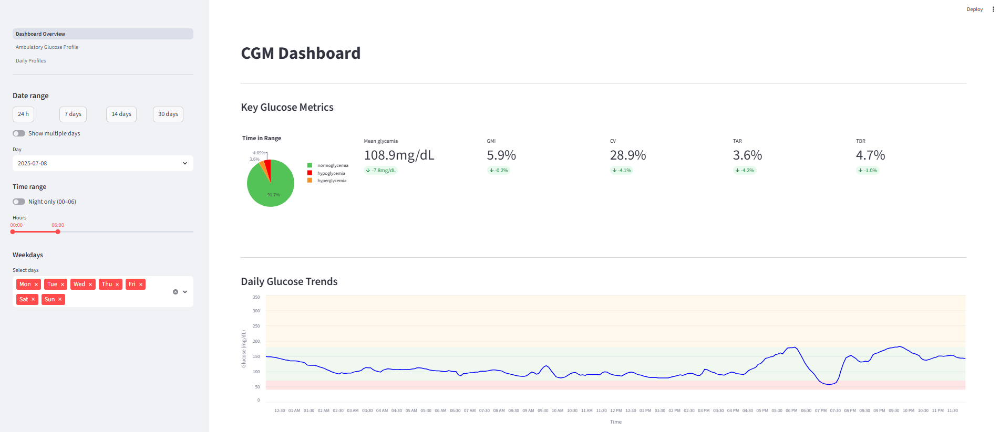
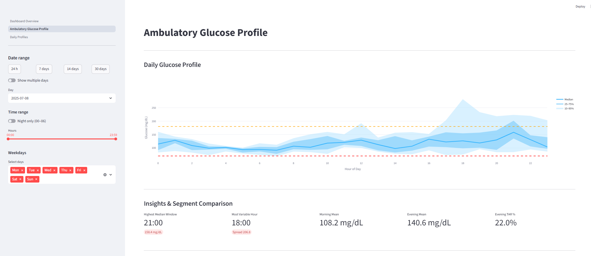
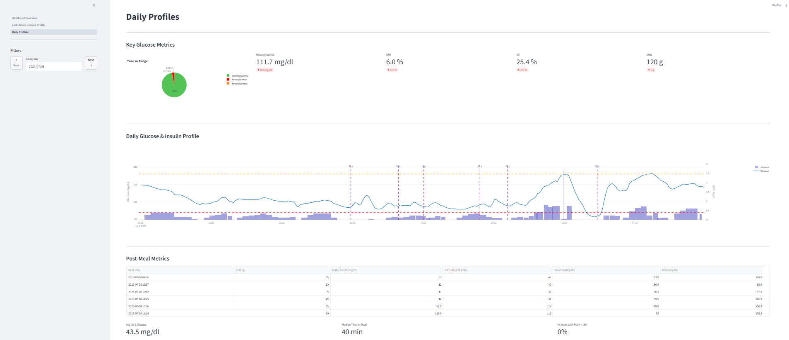

# CGM & Insulin Pump Data Analysis – Streamlit Dashboard

## Project Description

Interactive analytical dashboard for Continuous Glucose Monitoring (CGM) and insulin pump data.

The project focuses on evaluating glycemic control, identifying high-risk glucose patterns, and analyzing the relationship between meals, insulin dosing, and blood glucose response.

---

## Research Questions
- What is the overall glucose control profile (mean glucose, variability, hyper/hypoglycemia frequency)?
- Are there identifiable daily patterns in glucose levels?
- How do meals (carbohydrate intake) influence postprandial glucose spikes?
- Is there a relationship between daily carbohydrate intake and average glucose?
- How does basal insulin distribution vary across the day?
- Are specific time periods associated with increased glycemic risk?

---

## Tools & Technologies

- **Python (Pandas, NumPy, Matplotlib, Seaborn)**
- **Jupyter Notebook** – data cleaning & exploratory analysis
- **Streamlit** – interactive dashboard

---

## Key Metrics

- Mean Glucose  
- Time in Range (TIR)  
- Time Below Range (TBR)  
- Time Above Range (TAR)  
- Standard Deviation  
- Coefficient of Variation (CV)  
- Estimated HbA1c  

---

## Key Insights
- Glucose levels show high intraday variability, with repeated hyperglycemic spikes reaching ~250 mg/dL.
- A clear circadian pattern is present: lowest glucose levels occur in the morning, while evening hours show the highest averages.
- Daily minimum glucose remains relatively stable, whereas daily maximum values vary significantly — indicating controlled baseline glucose with post-meal excursions.
- Postprandial spikes are consistently observed after meals, with delayed peaks suggesting macronutrient composition impact.
- Higher daily carbohydrate intake correlates with increased average glucose levels.
- Basal insulin delivery follows a structured daily rhythm, peaking in the evening and increasing in early morning hours.
- The majority of measurements fall within the target range, though hyperglycemic episodes occur more frequently than hypoglycemic events.

---
## Dashboard Preview

### Overview


### Ambulatory Glucose Profile


### Daily Profile


---
## Dashboard Access

- 📁 Streamlit app: `/dashboard/Dashboard_Overview.py`
- 📊 Notebook analysis: `/notebooks`
- 📄 Processed dataset: `/data/processed`
- 🖼 Screenshots: `/screenshots`

---

## Notes & Limitations

- The analysis is based on historical CGM and insulin pump data.
- Results are descriptive and exploratory in nature.
- This project does not provide medical recommendations.
- External factors such as stress, illness, or physical activity were not fully controlled.


---

## How to Run the Project

### Clone the repository

```bash
git clone https://github.com/Alicja141004/CGM-Data-Analysis.git
cd CGM-Data-Analysis
```
### Install required dependencies
```bash
pip install -r requirements.txt
```
### Run the Streamlit application
```bash
streamlit run dashboard/Dashboard_Overview.py
```
### The dashboard will open automatically in your browser at:
```bash
http://localhost:8501
```
